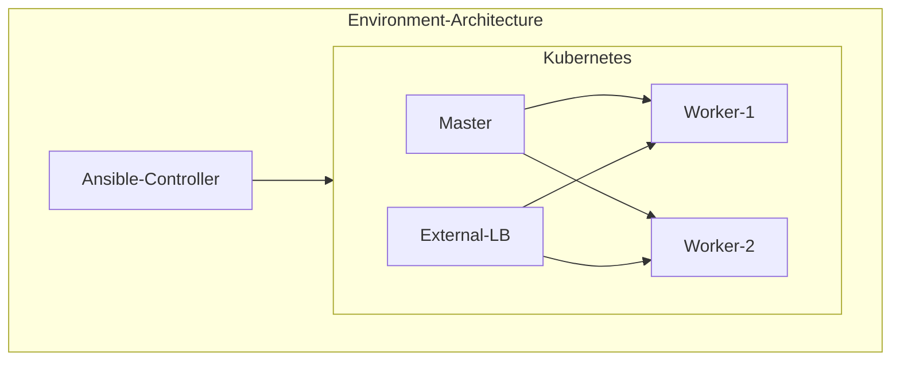

# K8s-Task

## Question
### Using tools and environments of your choice, create Kubernetes cluster containing:
    One master
    One or more nodes
    Access to kubernetes API is restricted to number of IP addresses.
    Document creating of cluster and all needed access rights in git repository.
### On the Kubernetes cluster:
    Deploy nginx ingress - https://github.com/kubernetes/ingress-nginx/.
    Deploy "Juice Shop" application, you can use official docker image from ‘bkimminich/juice-shop’. 
    Expose “Juice Shop” application inside the cluster using the a service.
    Expose “Juice Shop” application to outside the cluster using the nginx ingress.
    
## Answer
### Environment Architecture:
#### Same as the below architecture
    


#### Environment Description
    1. Ansible Controller: Acts as automation tool
       Ansible machine automates the whole cluster deployment process from building the cluster to deploying the app.
              
    2. K8s Master: A master node that manages two worker nodes
       It is not recommended to use this setup since it is not a High Availability master node cluster
       
    3. Two worker nodes: Used to host the applications

    4. HAProxy: Acts as External Load Balancer
       Since the setup uses the On-Premises cluster so we need an External Proxy that will redirect the connection to the cluster ingress controller

#### Steps to build environment

    A. Use the following table as your reference
|        Function         |          Hostname             |        IP            |       OS          |    RAM    |   CPUs    |   Disk  |
| ----------------------- | ----------------------------- | -------------------- | ----------------- | --------- | --------- | ------  | 
| Ansible Controller      |    control.ansible.local	  |   192.168.222.111/24 |   Oracle Linux 8	 |    4G	 |    1      |   20G   |
| HAProxy Load Balancer	  |     proxy.cluster.local	      |   192.168.222.112/24 |   Ubuntu-20.04.5	 |    512M	 |    1      |   10G   |
| K8s Master Node	      |    master.cluster.local	      |   192.168.222.113/24 |   Ubuntu-20.04.5	 |    2G	 |    2      |   10G   |
| K8s Worker Node 1	      |    worker1.cluster.local	  |   192.168.222.114/24 |   Ubuntu-20.04.5	 |    1G	 |    1      |   10G   |
| K8s Worker Node 2	      |    worker2.cluster.local	  |   192.168.222.115/24 |   Ubuntu-20.04.5	 |    1G	 |    1      |   10G   |

    B. PrePare all nodes in the environment - All following steps should be configured on each node
        1. NAT network with subnet 192.168.222.0/24 and gateway 192.168.222.1/24
        2. Static IPs > Mentioned in the table
        3. Hostname > Mentioned in the table
        4. Hosts file /etc/hosts
            192.168.222.111     control.ansible.local   control
            192.168.222.112     proxy.cluster.local     proxy
            192.168.222.113     master.cluster.local    master
            192.168.222.114     worker1.cluster.local   worker1
            192.168.222.115     worker2.cluster.local   worker2
        5. Stop and Disable firewall service
        6. Add a new user called ansible and set a password
        7. The ansible user should be in sudoers
            
    C. PrePare Ansible Node
        1. Install Ansible
        2. Gnerating public and private keys for ansible user
        3. Transfer the public key to the managed nodes

    D. Build the cluster and deploy the application using the current GitHub repo
        1. git clone https://github.com/OsamaBadr1/DevOps-Task.git
        2. cd DevOps-Task/K8s-Task/
        3. ansible-playbook playbook.yml
     
     E. Access the application
        1. No need for any inputs when running the playbook
        2. The playbook hierarchy is listed below
        3. To access the application on your private machine configure the hosts file with the following entry
            192.168.222.112   juice-shop.demo.com
        4. Access the app from your web browser
            http://juice-shop.demo.com
        
```bash
.
|-- ansible.cfg
|-- cluster-preperation.yml
|-- deploy-juice-shop-app.yml
|-- initialize-master.yml
|-- install-external-haproxy.yml
|-- inventory.yml
|-- join-worker.yml
|-- playbook.yml
|-- README.md
`-- roles
    |-- cluster-preperation
    |   |-- files
    |   |   `-- k8s.conf.modules
    |   `-- tasks
    |       `-- main.yml
    |-- deploy-juice-shop-app
    |   |-- files
    |   |   `-- ingress-resource.yml
    |   `-- tasks
    |       `-- main.yml
    |-- initialize-master
    |   `-- tasks
    |       `-- main.yml
    |-- install-external-haproxy
    |   |-- handlers
    |   |   `-- main.yml
    |   |-- tasks
    |   |   `-- main.yml
    |   `-- templates
    |       `-- haproxy.cfg.j2
    `-- join-worker
        `-- tasks
            `-- main.yml
```


